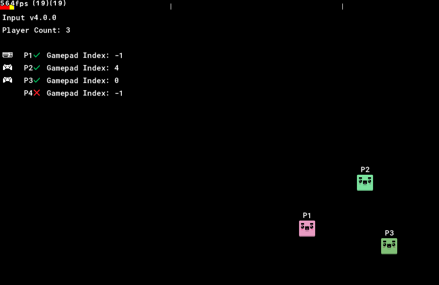

    

## GameMaker 2 Local Multiplayer Example with Input

Tested in GameMaker 2 IDE v2022.2.1.618 and Runtime v2022.2.1.491.

This is an example project released along with my [Input Guide on YouTube](https://youtu.be/y-gGVmnUfdQ) and demonstrates the following:

+ How to create an input manager object to bind both keyboard and gamepad controls.
+ How to watch, bind, and instantiate new players with `input_source_detect_any()`
+ How to remove/clean-up players when a bound device is disconnected.

This is not production-ready code and only acts as a demonstration of one method to bind/unbind players in your game during runtime.

If you have any questions or concerns, please refer to the [official repo](https://github.com/JujuAdams/Input)

Good luck!